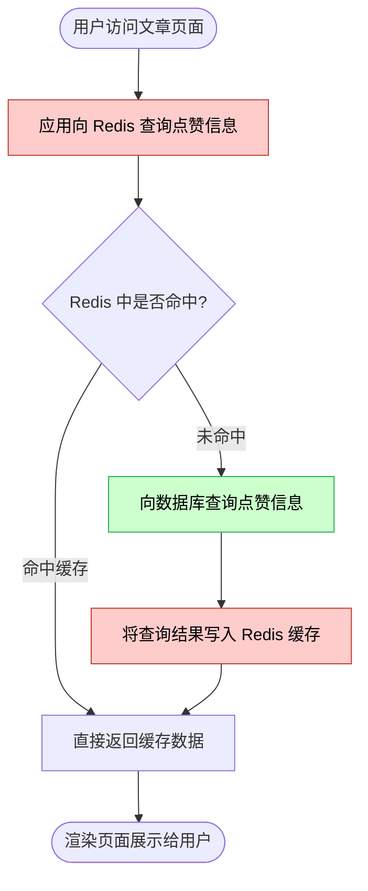
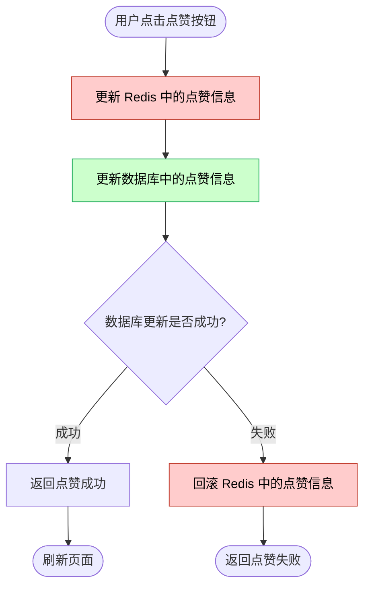

#### 项目总结
##### 项目中遇到的几个性能问题
1. 点赞的场景，我使用了Redis来存储点赞信息，避免了数据库的频繁操作，但没有想到，Redis和应用不在同一个区域部署，导致Redis超时了，然后需要处理Redis和数据库之间的同步，性能反而下降了。

**查询页面流程（读操作）：**

**点赞操作流程（写操作）：**

> 💡 由于 Redis 与应用不在同一区域，每一次查询（未命中时）和每一次点赞都需要跨区域访问 Redis，网络往返耗时叠加后导致整体性能下降。

2. 当用户文章保存了后，使用`router.refresh()`来刷新列表页面，但这会导致页面加载需要一定时间，会比较慢。`router.refresh()`方法会将客户端的state保留，服务端的数据重新拉取。最初，我改成使用`react query`来刷新数据，但其实，靠的是`router.push`方法来刷新服务端列表数据的，后面改成了把supabase 修改文章的操作，封装在action 中，把`revalidatePath/revalidateTag`，也写在action中。`revalidatePath`的含义，revalidatePath(path) = 主动清除指定路由路径的全局 RSC 缓存。这块，后面把所有的`router.refresh`都优化了下

